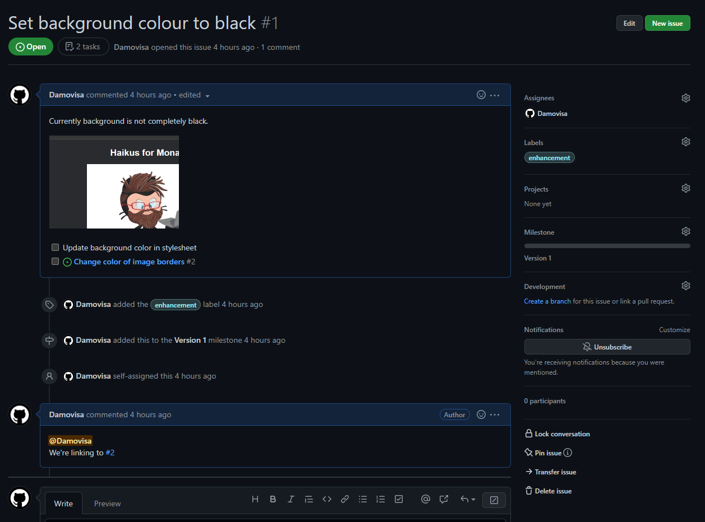

# Exercise 1 - Create an Issue
We're going to create a new issue for some work we want done - updating the background colour of our site to a color other than a dark shade of grey.

1. Navigate to the Issues tab in your repository
2. Click `New issue`
3. Type an appropriate title and add some text to the description.
4. Add an image into the description. You can paste from the clipboard, drag an image file into the browser, or click the bar at the bottom of the text area.
5. Add a task list using the checkbox icon at the top of the text area . Add two tasks - one to change the background color in the stylesheet, and another to change the border color on the images.
6. Assign yourself in the `Assignees` section on the right
7. Add an appropriate label in the `Labels` section using the cog icon.
8. Add this issue to a new Milestone using the cog in the `Milestones` area and typing a new name to create.
9. Change to the Preview tab to ensure it looks the way you want.
10. Save the Issue.

At this point, you have an issue that represents this piece of work. But there are a few more things we can do.

1. Hover over one of the tasks in your task list, and click the  icon to the right to convert this task to an issue.
2. Click the link to the new issue and see that it's being tracked by Issue #1. Click the link to go back to its parent.
3. Leave a new comment about this issue at the bottom. Use the `@` character to reference someone (maybe your proctor), and the `#` character to reference another issue.

## Resources:
- [GitHub-flavoured Markdown](https://docs.github.com/en/get-started/writing-on-github/getting-started-with-writing-and-formatting-on-github/basic-writing-and-formatting-syntax)