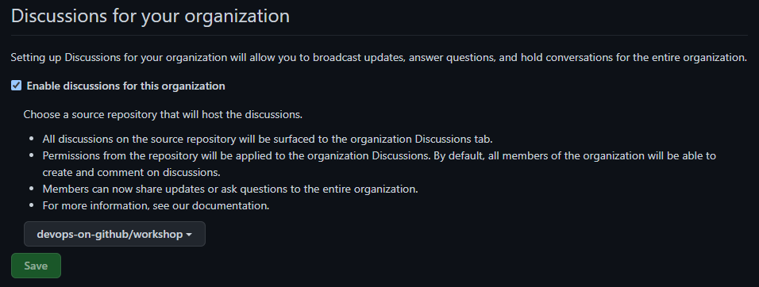

# GitHub Discussions

[GitHub Discussions](https://resources.github.com/devops/process/planning/discussions/) brings community forums right to your public or private repositories on GitHub making it easy to communicate with your community, ask and answer questions, share updates, and more.

As well as being valuable for Open Source projects, they can be valuable as a forum for asynchronously discussing projects within your teams and organisations. 

## Discussions for this workshop

We've set up [Discussions for this workshop repository](https://github.com/devops-on-github/workshop/discussions) which we'll use during the workshop for Q&A and any polls or async discussions.

You can also configure [organisation-level Discussions](https://github.com/orgs/devops-on-github/discussions) by choosing a specific repository. You won't have administrator access to this organisation, but here's what configuration looks like:

### 👩‍💻 Exercise 1

[▶️ Using Discussions](exercise-1.md)

In this exercise, we'll interact with Discussions for the workshop. We'll respond to existing discussions and create our own.

_This is primarily an exploration exercise, so feel free to experiment! You won't break anything I promise._

### 👩‍💻 Exercise 2

[▶️ Enabling Discussions for your repository](exercise-2.md)

In this exercise, you'll enable discussions for your own repository and do some configuration.

# Next
[Projects &gt;](../2.3-Projects/)