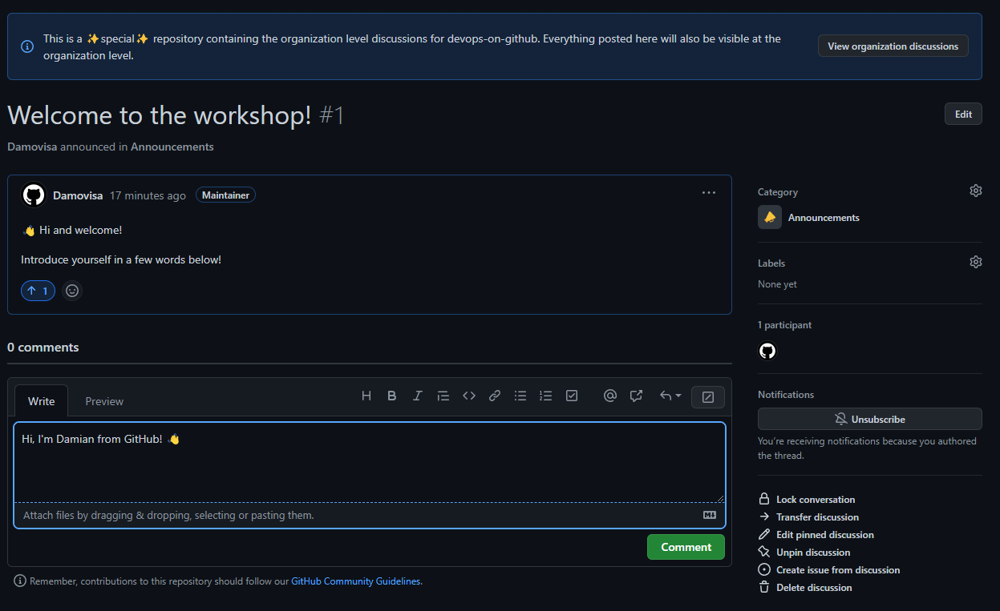
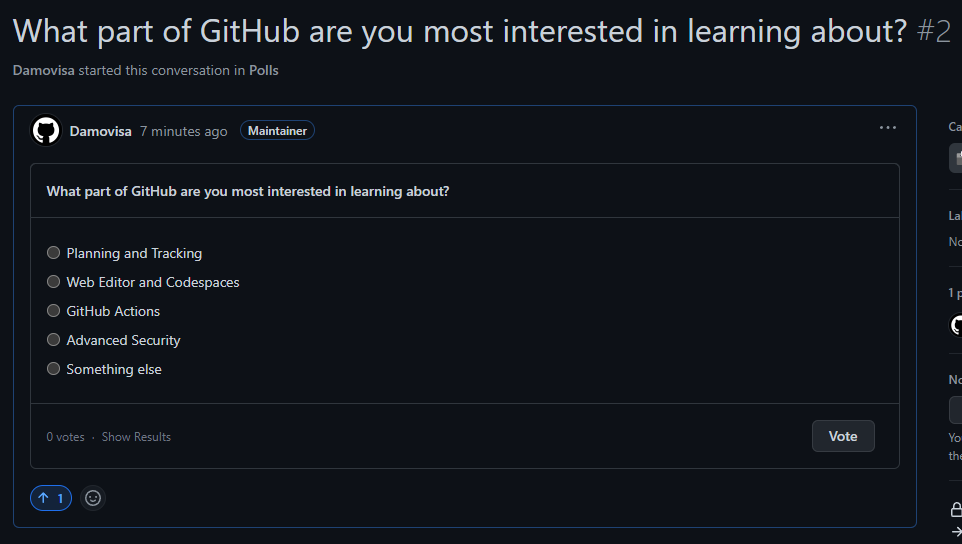
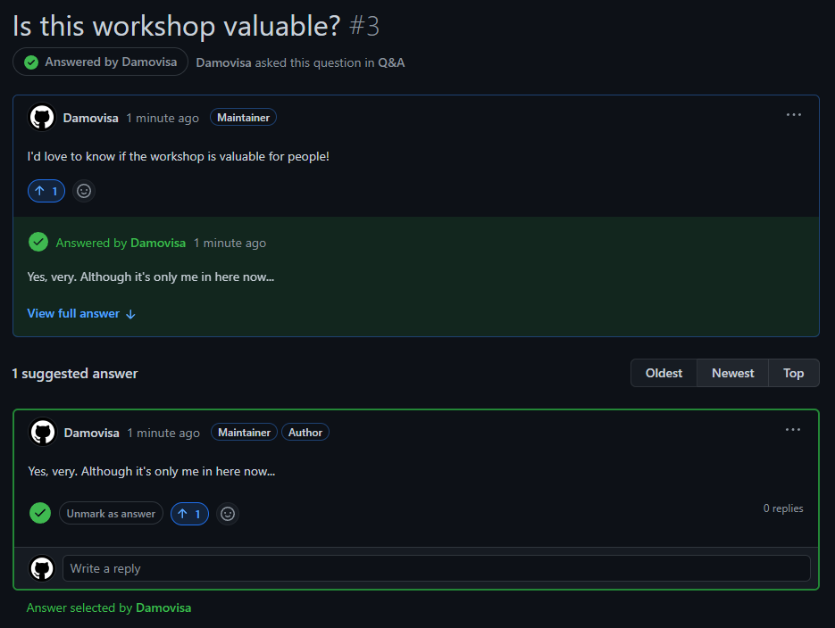
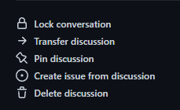

# Exercise 1 - Using Discussions

In this exercise, we're going to interact with the workshop Discussions.

_This is primarily an exploration exercise, so feel free to experiment! You won't break anything I promise._

1. Navigate to https://github.com/devops-on-github/workshop/discussions to see the Discussions feature for the workshop repository.
2. Now navigate to https://github.com/orgs/devops-on-github/discussions to see the organisation discussions. Note that the same content appears, but is presented slightly differently.
3. Navigate back to https://github.com/devops-on-github/workshop/discussions.
4. Use the categories on the left to filter the discussions by category and find the `Welcome to the workshop!` discussion. Click it to open.
5. Click the up arrow to vote up the discussion, and the smiley face emoji to "emote" on it.
6. Leave a comment with a very short introduction.

7. Navigate back to the Discussions page and find the Poll.
8. Leave a vote and optionally comment, "upvote" and "emote"

9. Finally, create a new Discussion
10. Choose the Q&A category and add a question (don't overthink it - anything is fine!)
11. Add an answer (or ask a neighbour to answer)
12. Click "Mark as answer" to mark the question as answered

One useful aspect of GitHub is being able to link between different parts of the product. If a discussion has led to a piece of work you need to track, you can create an issue from the discussion with a click.

13. Navigate to the Q&A discussion you created.
14. At the bottom-right of the discussion, click `Create issue from discussion`

15. Note that appropriate markdown has been produced with details and a link to that discussion