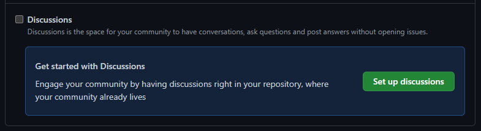

# Exercise 2 - Enabling Discussions for your repository

Let's enable discussions for our own repository and change a few defaults.

1. Navigate to Settings for your own repository
2. Scroll down to the Discussions checkbox in Features and check the checkbox
3. Click "Set up discussions"

4. Add a new announcement post (a sample is already open!)
5. Navigate to the Discussions tab
6. Click the pencil icon next to Categories
7. Remove the Show and Tell category, moving any discussions to the General category
8. Add a new "Feedback" category and choose an appropriate emoji by clicking on the icon next to the name
9. Change the Discussion format to `Open-ended discussion`
10. Click `Create`
11. Navigate back to the Discussions tab to see your changes.

We can also pin important Discussions to the top of the Discussions page. You'll notice that the announcement we created to begin with has been pinned.

12. Create a new discussion in the General category to remind people to submit timesheets
13. At the bottom-right of that discussion, click the `Pin discussion' link to pin it to the top of the Discussions page. Choose an appropriate background.

14. Navigate back to the Discussions tab to see the newly-pinned discussion.