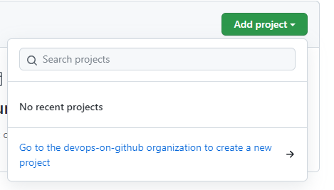
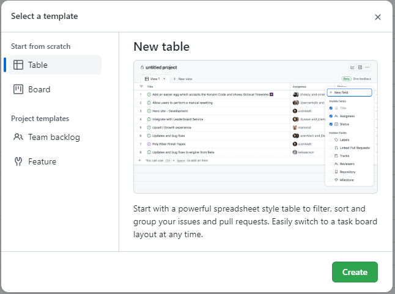
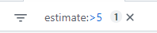
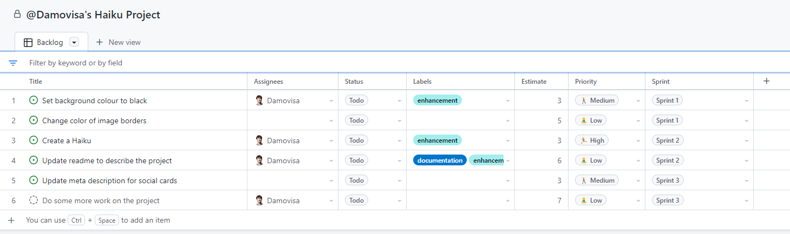

# Exercise 1 - Create a Project

In this exercise, we'll create a project for your repository and show how you can customize it and add your own custom fields.

1. In your repository, click on the Projects tab
2. Click on `Add Project` and note that you're prompted to create a new project at the organization level

_This is important: Projects belong to the organisation rather than the individual repository. This allows you to pull in issues from a number of repositories."

3. Click the link to create a project for the organisation

4. Click `New project`, leaving the template as the default `Table` view

5. Add each of the issues you created earlier in your repository. You can start by pressing the `#` key and choosing your repository (make sure you choose your own!)

_Note: You can use the keyboard here. After the first one, you may only need to hit `Enter` a few times to add the rest!_

6. Click on an issue title. More details should show on a sidebar.
7. Click on the `+` to the right of the last column and add the `Labels` field.
8. Create new custom fields for `Estimate` (Number) and `Priority` (Single select: Low, Medium and High)
9. Set some of the missing values for the issues on your board. Experiment with using the keyboard as well as the mouse!

10. Sort by priority by clicking the 🔻 arrow in the Priority column header (you'll see it when you hover)
11. Group by priority, but this time use the keyboard - `Ctrl/Cmd-K`. This is the "Command Palette"
12. Remove the sorting and grouping by clicking on the 🔻 arrow in the Priority column header
13. Use the Command Palette to filter items to only those with an estimate greater than 5 (or an appropriate number for your values).

_Hint: The filter at the top of your table should look like this: _

14. Add a new "draft issue" by clicking on the bottom row (after your last issue) and typing a title.

_Note that you can fill in most of the fields for this draft issue even though it does not belong to a repository! We won't do it in this exercise, but you can click the 🔻 button to the left of the draft issue to convert it to a real issue in a repository._

Already you can see that you have a lot of control over how you manage your items. Let's do one last thing that will really help with project work.

15. Add a new custom field called `Sprint` and choose the `Iteration` column type. Feel free to modify the iteration length and start date before clicking `Save and create`
16. Fill in values for this column for your issues. Spread your issues across the sprints that have been generated.
17. Click on the ellipses at the top right of the page, and click `Settings`
18. Here you can edit your custom fields, including your new Sprint field. You can add breaks, change dates, rename sprints, and add new iterations. Have a play, then click the ⬅️ next to `Settings` to return to your project table.

This looks good! It's time to save our backlog and move on.

19. Click on the Title of the project and give it a name
20. Click on the tab at the top of the table and rename the view

_Note: Before saving, you might want to add some grouping or sorting. It's your project - Customize it however you want!_

21. Finally, click the 🔻 next to your new view title and click `Save changes`

## Resources:
- [About Projects - GitHub Docs](https://docs.github.com/en/issues/trying-out-the-new-projects-experience/about-projects)
