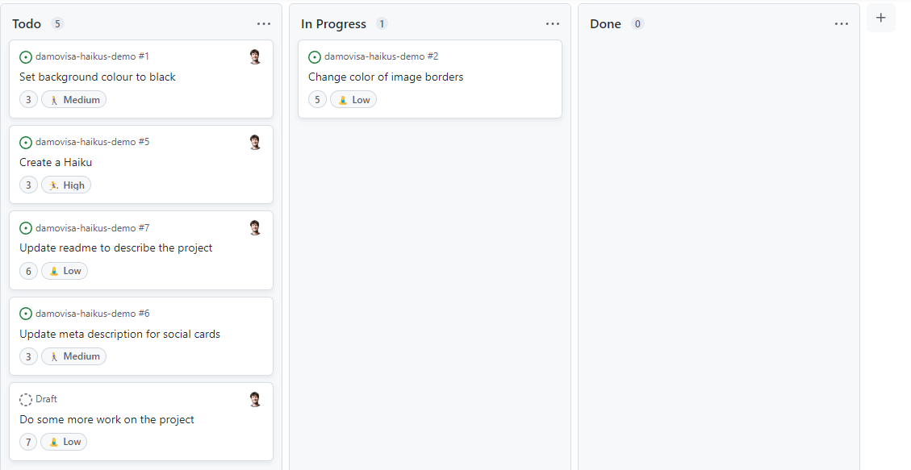

# Exercise 2 - Create a Sprint Board

We've created a custom field to manage our sprints, so it makes sense that we'd have a board for managing our work!

In this exercise, we'll introduce the board view and you'll create a sprint board.

1. Click the `+ New View` link next to the backlog view title to create a new view of your data. Note that our custom fields (while still there) are not being shown.
2. Click the 🔻 button next to the new view title and choose `Board`

You should now be seeing your issues in a table view, with the columns by status.

3. Click the 🔻 button next to the view title and click `Title, Assignees, and Status`. Add any additional fields you'd like to see on your cards (e.g. Estimate and priority)
4. Click the 🔻 button again and choose `Column field:Status`. Experiment with changing the column before changing it back to Status.
5. Use the Command Palette (`Ctrl/Cmd-K`) to filter your board to only high priority issues. Delete the filter before continuing.
6. Drag one of the issue cards from the Todo column to the In Progress column.

You can see that this view behaves very similarly to the table view in some ways, and quite differently in others. Ultimately, it's all the same data, just massaged and viewed in a way that makes sense for your use case.

Now it's your turn!

**Using what you've learned, create a sprint board. It should meet the following requirements:**

1. Filtered to issues in the current sprint
2. Columns should be by Status
3. Cards should show labels, the estimate, and the priority
4. The board should be named appropriately and saved

5. **Bonus:** Add a "Blocked" status to your project