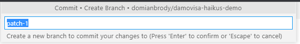
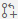
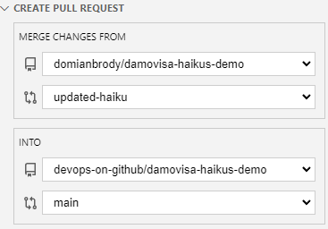

# Exercise 1 - Submit a Pull Request

1. Navigate to [The trainer's repository](../../../damovisa-haikus-demo)
2. Press the `.` key or change the URL to `github.dev` to open the web-based editor.
3. Make a change to the `haikus.json` file - any change will do, but be polite!
4. Click the Source Control icon in the Activity Bar
5. Add a commit message, click `+` to add the file, then click ✓ to _try_ to commit the change.

_You should be given a prompt to fork the repository because you don't have write access!_

6. Click `Fork Repository`
7. In the prompt, give the branch a name. Note that your fork has been created in your _personal_ GitHub account, but it's been made private.

8. Click `Switch to Fork` to swap over to your fork of this repository. The web-based editor should reload.

Let's quickly revise this flow:
- We edited a file in a repository, but didn't have write access
- We created a new fork of the repository (one we could write to)
- And a new branch for the work we're doing
- Finally, we switched the web-based editor to that branch

Now we're able to make changes, and submit a pull request, so let's do that.

9. Navigate to the `haikus.json` file and note that your changes are still there. We don't need to make them again.
10. Click the Source Control icon in the Activity Bar and note that there are no pending changes. Our change has already been committed to our fork!
11. Click the pull request icon  to submit a pull request. Give it a title and description before clicking `Create`.

_**Important:** Make sure you're submitting a pull request **to the `devops-on-github` repository!_

Once again you're shown the PR details, but note that this time you can't approve! Remember, you don't have access to this repository.

12. Click `Exit Review Mode` to go back to your `main` (or `master`) branch.
13. Look at the URL and note that you're still in your personal fork.