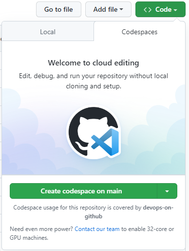
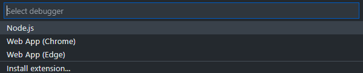
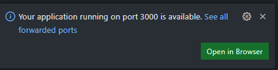
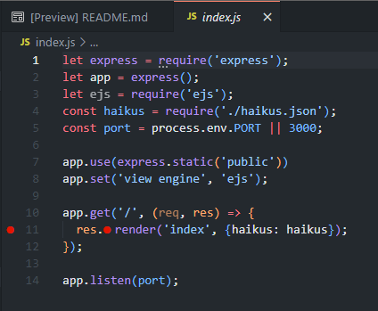
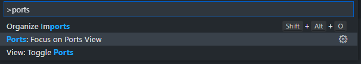

# Exercise 1 - Create a Codespace and Debug

1. Navigate to the Code tab for your repository
2. Click the green `Code` button and click the Codespaces tab in the dropdown that appears

Note that you're told how you'll be charged (covered by the org) and that you can contact GitHub if you need more powerful machines.

3. Click the 🔻 to the right of the `Create codespace on main` button and choose `Configure and create Codespace`. Now click the button.
4. Explore each of the options. Note that not all VM options have been enabled. These and other policies can be managed in your organisation settings.
5. Create a 4-core Codespace and wait for it to load.

We're in VS Code again! The difference here is that we're running on a VM in the cloud rather than running in your browser.

6. Click the `Run and Debug` icon in the Activity Bar, then click the green `Run and Debug` button.
7. In the dropdown, select the 'Node.js' debugger.

8. Look for a notification at the bottom right of the window, and click `Open in Browser`

_Note: It can take a minute for the node server to respond to requests. If you get an error, wait a few seconds and refresh_

You should be able to see the Haiku application up and running!

9. Switch back to your Codespace tab (don't close the running application tab)
10. Click on the `Explorer` icon in the Activity Bar and locate the `index.js` file.
11. Click to the left of line 11 (`res.render...`) to set a breakpoint.

12. Switch back to the tab with your application and refresh.
13. Switch again to the Codespaces tab and see that your breakpoint has been hit! You can hover over variables and even use the debug console to examine what's going on!
14. Press F5 or click the pause/play button at the top of the window to continue.

Next, we're going to share our running application to help with collaboration.

15. In your Codespaces window, type `Ctrl/Cmd-Shift-P` to bring up the Command Palette.
16. Search for "ports" and select `Ports: Focus on Ports View`.

17. Right-click on the open port, scroll down to `Port Visibility` and click `Private to Organization`.
18. Share your URL with a neighbour - you may need to get creative to do so!
19. Note that when someone else visits your app, your breakpoint will get hit!
20. Remove the breakpoint and stop debugging using the ■ button.

## More collaboration...

While we won't use it in this workshop, the [Visual Studio Live Share](https://marketplace.visualstudio.com/items?itemName=MS-vsliveshare.vsliveshare) extension is a great way of pair-programming in a Codespace. Because a Codespace is just running VS Code, this extension can be installed into your Codespace. There's even an extension for voice calls over Live Share!