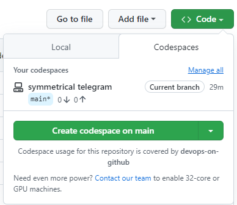
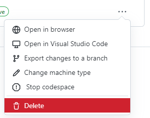

# Exercise 3 - Test what you've learned!

Now we've walked through creating a Codespace, let's run through how you'd actually configure and use one for your project.

## Before we start...

Let's delete our existing Codespace.

1. Go to the Code tab for your repository
2. Click the green `Code` button and then click the `Manage All` link above your Codespaces

3. Click the ellipses next to your Codespace. Before you click `Delete`, look at the other options - particularly `Export changes to a branch`. Ok, now delete your Codespace.

## Up to you!

Using what we've learned about Codespaces and planning and tracking your work, perform the following tasks:

1. Create a new Codespace
2. Customize the devcontainer, using the `Node.js and PostgreSQL` image, version `16-bullseye`. Include either the AWS or Azure CLI. Make note of the additional `dockercompose.yml` file that's been created this time.
3. Rebuild to make sure everything works, then commit and push your changes (_Important: You'll need to push this time, not just commit!_).
4. Use the GitHub extension to start work on the issue you created to "add a new haiku"
5. Add a new Haiku to the `haikus.json` file
6. Debug the application and make sure your new haiku appears correctly
7. Commit the change, push to your branch, and then create a pull request.
8. Merge the PR (either in the Codespace or the web-based editor if you'd prefer!)
9. Finally, go to your project board and ensure the issue has been moved to a `Done` status.