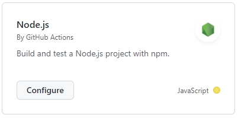

# Exercise 1 - Create a workflow

_Note: this exercise is a guided exercise mainly so we can examine what you'll see at various stages and give everyone an opportunity to ask questions. There's a lot to GitHub Actions and we want to make sure everyone is on the same page as we go!_

1. In your repository, navigate to the `Actions` tab
2. Click on `New workflow` button or click in the search bar to find a template to get started.

_Note: If you completed all the exercises from yesterday, you should see some Codespaces prebuilds in the list of workflow runs. Codespaces prebuilds do use GitHub Actions, but they're managed by GitHub and won't appear in the `.github/workflows` folder of your repository_

3. On the next page, scroll through the templates to get an idea of what's possible. You'll note that there are suggestions at the top based on the code that's in your repository.
4. Locate the `Node.js` template and click `Configure`



5. Look through the resulting YAML. Take note of the syntax including the triggers, single job, and steps. **We'll go through these together.**
6. On the right, do some searches in the Marketplace window. You'll see there's a huge range of actions ready to use.

_Fun fact: At time of writing, there are more than 13,600 Actions you can use in your own workflow!_

7. Without changing the file, click `Start commit` and commit the new workflow file to the `main` branch. This will commit a yaml file to the `.github/workflows` folder in your repository.

8. Again, click the Actions tab in your repository. You should see two workflows running. One is the codespaces prebuild, so you can ignore that one for the moment!


9. Click the workflow run to watch it executing. As it runs, we'll discuss what's happening.
10. You'll note that there's an error with Node 16. Drill into that error to see what's happening and notice that it's because we have no tests!

We're going to fix this issue quickly!

11. Navigate to the Code tab for your repository and then open the web-based editor (press `.` or change the URL to github.dev)
12. Find your workflow definition YAML file in the `.github/workflows` folder and modify the final `npm test` line so it reads as below. Note the indentation! It needs to be exactly right!

```yaml
  - run: npm test --if-present
```

13. Save and commit the file
14. Navigate back to the Actions tab for your repository and watch this new workflow run.
