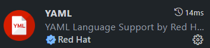

# Exercise 2 - Use what we've learned so far

Now you know how GitHub Actions fits together, it's time to put it into practice and add a few more pieces.

1. In your repository, go to the `Settings` tab and scroll down to click `Secrets` then `Actions`
2. Click the `New repository secret` button
3. Create a secret with the name `MY_SECRET` and add a value of your choosing, then click `Save`

_Note that there's no edit button for this secret. Secrets are write-only!_

4. Click on the `Code` tab, then press `.` to open the web-based editor.
5. Find and open your workflow definition file located in `.github/workflows`

_Tip: You will find it easier to work with Actions YAML if you install the YAML extension from Red Hat. It gives you validation and auto completion for a number of different YAML schemas._



5. Change the runner to use `windows-latest` rather than ubuntu
6. Create a second job that runs on `ubuntu-latest` and depends on the first job (remember the `needs` keyword!)
7. In the second job, add a step to echo the secret you set. You can use a `run` step with the following command:

```bash
echo ${{ secrets.MY_SECRET }}
```

9. Add another step to add the [URL Health Check](https://github.com/marketplace/actions/url-health-check) action to ping a website of your choosing.
10. Commit your changes with an appropriate commit message
11. Navigate to the Actions tab and watch your workflow running!

## Notes
There are a couple of things to examine in your the end result:
- Did the workflow run _look_ different in the UI?
- What was the result of echoing your secret?