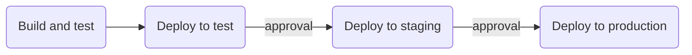

# Software Delivery and CI/CD with Actions

Automation is a core principle for achieving DevOps success and CI/CD is a critical component. CI/CD comprises of continuous integration and continuous delivery or continuous deployment. Put together, they form a “CI/CD pipeline”—a series of automated workflows that help DevOps teams cut down on manual tasks:

- **Continuous integration (CI)** automatically builds, tests, and integrates code changes within a shared repository; then
- **Continuous delivery (CD)** automatically delivers code changes to production-ready environments for approval; or
- **Continuous deployment (CD)** automatically deploys code changes to customers directly.

There's a bit of nuance and argument around these statements. But to simplify - Continuous Integration builds and tests, Continuous Delivery gets everything deployable, and Continous Deployment deploys it.

## Build Once, Deploy Many

Often, teams will use branching to control deployment flow. While this technique can work, it's not one we recommend.

When branches are involved, code might be integrated and tested on a "dev" branch, then merged to a "staging" branch" where it's built again, then deployed to a staging environment. Finally, it's merged again to a "release" or "production" branch for another build and a deployment to production.

The problem here is that each release is dependent on a successful merge and rebuild. While 99 times out of 100 this may be fine, your pre-production testing is testing different code and a different set of binaries to what you'll ultimately be deploying to users. And that's a problem.

Instead, we should aim to build our application once, then promote that artifact through our release pipeline - test, QA, staging, etc. Controls can be set at each stage for signoff or automated testing if required.

This is one of the reasons containerization is so powerful. Rather than building an application and deploying it to a new environment when you promote, the application and much of its surrounding infrastructure and dependencies are part of the deployable package. You can build once, and deploy everywhere.

One key point - your main branch should represent your deployable code. Or to put it another way, you should aim to _always_ be able to build and deploy your main branch.

To do this, you should (as much as possible) practice trunk-based development. To handle scale and help ensure your trunk is always deployable, topic or feature branches can be used provided they're short-lived. However work should be merged into the main branch as frequently as possible.

## Environments and Approvals

A delivery pipeline should ideally contain a CI phase, then a series of deployment phases through the intended environments. Testing can be incorporated at or between any of these phases.

For example, you may have a workflow that has 4 jobs shown below:

Everything is automated, and the only intervention is between phases where approval is required.

To do this in GitHub, we can use [Environments and Environment Protection Rules](https://docs.github.com/en/actions/deployment/targeting-different-environments/using-environments-for-deployment).

### 👩‍💻 Exercise 1

[▶️ Set up CI/CD for the project](exercise-1.md)

In this exercise, we're going to set up a CI/CD pipeline using Environments and Environment Protection to control deployments.

_Note: Due to the complexity and cost of setting up cloud environments for hosting, we're not actually going to deploy. **However** if you do have cloud environments, proctors may be able to assist you in deploying!_

## Pull Request Checks

[Pull Requests](https://docs.github.com/en/pull-requests/collaborating-with-pull-requests/proposing-changes-to-your-work-with-pull-requests/about-pull-requests) are a sometimes controversial practice. Particularly in small, trusting teams.

Opponents point to the added overhead of PR reviews, the delay in merging changes, and the formalized and impersonal collaboration it encourages. Vehement opponents may even insist you can't do CI with pull requests because you're not continuously integrating!

Proponents value the additional protection a PR process adds to the main branch (which should ideally always be deployable), the ability to run automatic checks before merging into your main branch, and the fact it allows geographically remote people in different timezones to collaborate.

Where your team and organization lie on this spectrum is something you'll have to discover yourself, but if you do use pull requests, there are some practices you can follow to improve efficiency. It's also worth emphasising that PRs should _not_ be the only way you collaborate with your team!

### 👩‍💻 Exercise 2

[▶️ Set up a PR check](exercise-2.md)

In this exercise, we're going to set up pull requests with some automatic checks. We're also going to protect our main branch so you _must_ use pull requests.

## GitHub Packages as an artifact store

Up to now, we've just used the `actions/upload-artifact` action to save artifacts alongside the workflow run. But you may want your artifact to be available outside GitHub Actions, and for a longer time.

[GitHub Packages](https://github.com/features/packages) is a software package hosting service built into GitHub that allows you to host your software packages privately or publicly and use packages as dependencies in your projects. You can easily publish or download packages from Actions with easy authentication.

The [GitHub Packages documentation](https://docs.github.com/en/packages) can teach you how to use it.