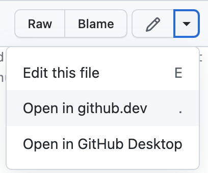
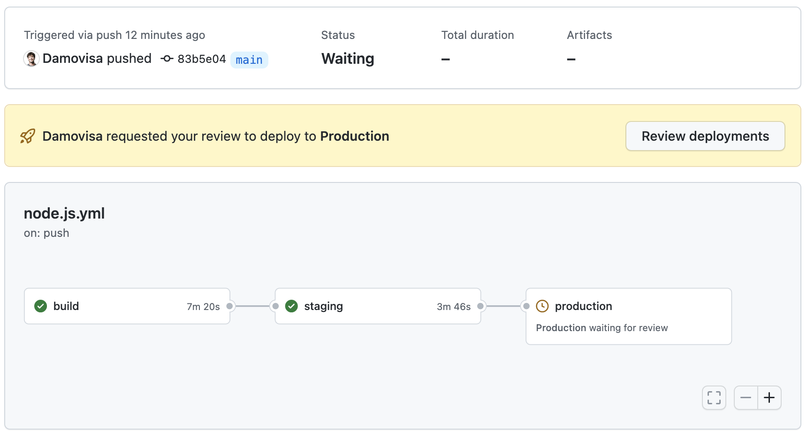

# Exercise 1 - Set up CI/CD

In this exercise, we're going to set up a CI/CD pipeline using Environments and Environment Protection to control deployments.

_Note: Due to the complexity and cost of setting up cloud environments for hosting, we're not actually going to deploy. **However** if you do have cloud environments, proctors may be able to assist you in deploying!_

1. In your repository, navigate to `Settings` then `Environments`
2. Create two environments - "Staging" and "Production".
3. Add an Environment Protection Rule to the "Production" environment, adding yourself as a required reviewer.
4. Click on the `Code` tab and navigate to your workflow definition YAML file in the `.github/workflows` folder.
5. Click the dropdown next to the pencil icon and either edit the file in the browser or choose `Open in github.dev`.



6. Change the runner in the first job back to `ubuntu-latest`
7. Remove the matrix strategy
8. Change the name of the `Use Node.js` step to remove the expression with the matrix context
9. Change the `with` in that step, replacing ` ${{ matrix.node-version }}` with `16.x`
10. Add a step in the build job to upload an artifact:

```yaml
    - name: Upload artifact
      uses: actions/upload-artifact@v3
      with:
        name: haiku-app
        path: .
```

_Note: We're going to fake deployment here for reasons previously mentioned, but if you'd like to actually deploy, you may want to check out [this example of deploying to Azure](https://github.com/ItalyPaleAle/haikus-for-codespaces/blob/main/.github/workflows/azure-webapps-node.yml)_

11. Remove the second job you created in the last exercise (or just modify it) to create a new `staging` job
12. Set the environment for the job to `Staging`

```yaml
    environment: Staging
```

13. Use the `actions/download-artifact@v3` action to download our artifact:

```yaml
    - name: Download artifact
      uses: actions/download-artifact@v3
      with:
        name: haiku-app
        path: haiku-app
```

_Here we would normally use those files to upload to our cloud provider (or similar), but instead we'll show the contents in the log_

14. Add another step that runs a bash script:

```yaml
    - run: ls ./haiku-app
```

15. Duplicate the whole `staging` job, renaming it `production`
16. Change the `needs` value to `staging` and the `environment` value to `Production`.
17. Save the file, then commit it to your repository with an appropriate commit message

Ok, let's see if it ran!

18. Navigate back to your repository, and the `Actions` tab.

After a while, this summary tab should show something similar to the below. It's waiting for you to approve the deployment to production!



19. Click on `Review deployments`, leave a comment, and approve the production deployment.

## If you get stuck

If you get stuck, check out the finished [node.js.yml](node.js.yml) file in this folder.
