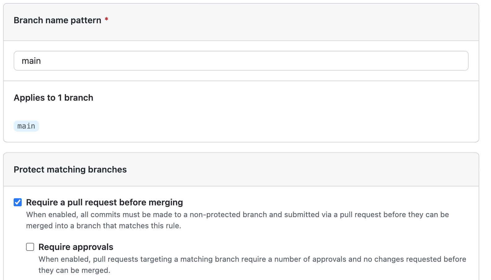
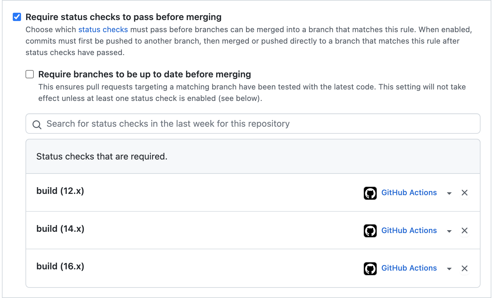
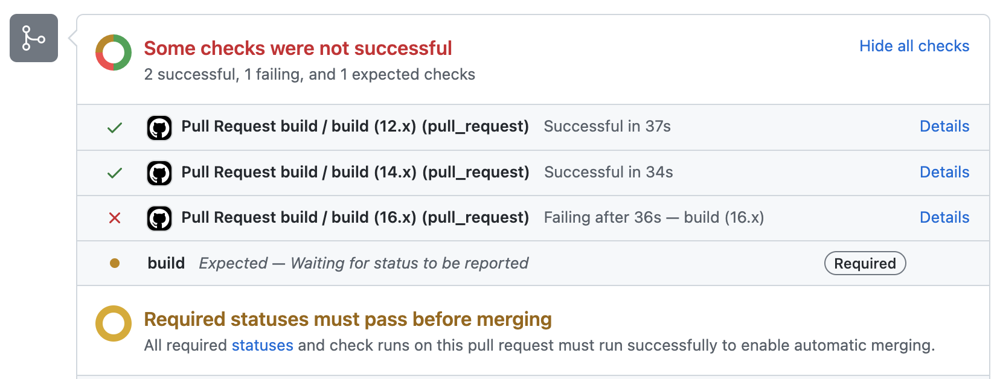
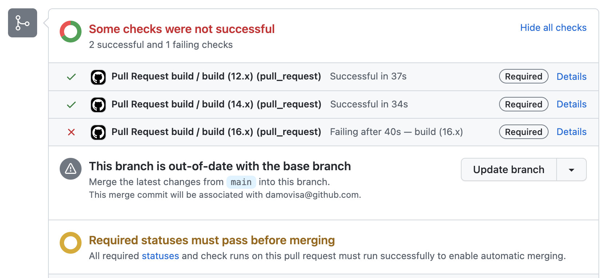

# Exercise 2 - Set up a PR check

In this exercise, we're going to set up pull requests with some automatic checks. We're also going to protect our main branch so you _must_ use pull requests.

1. Edit your workflow yaml to change the trigger to only build on a push to main:

```yaml
on:
  push:
    branches: [ "main" ]
```

2. In your repository, navigate to the `Actions` tab and create a new workflow
3. Again choose the `Node.js` template, but this time name it `pr.yml`, change the name of the workflow in the yaml, and change the trigger to the following before saving and committing.

```yaml
on:
  pull_request:
    branches: [ "main" ]
```

We've now set up two separate workflows - one will run when code is pushed to main, and the other when a pull request is created. The first workflow will deploy, but the PR workflow will not.

4. In your repository, navigate to the `Settings` tab and then `Branches`.
5. Add a new Branch Protection Rule for the `main` branch:
  - Check `Requires a pull request before merging`
  - Uncheck `Require approvals`
  - Check `Require status checks to pass before merging` and add `build (12.x)`, `build (14.x)` and `build (16.x)` to the checks that are required.




6. Click `Save changes`

Now we've protected our main branch! All changes need to go through a pull request process that runs a CI workflow ensuring that it compiles and our tests pass.

You can put anything you like in this workflow, but make sure you're conscious of the time this workflow takes to run. If your PR check takes 15min to run, that means no feedback to the team member who created the PR for up to that long!

Now let's test it out.

7. In the web-based editor (or Codespaces if you'd prefer), use the GitHub extension to work on an Issue. Let's choose the issue to fix the readme.

Remember that when you start work on an Issue this way, you'll create a new branch to work on, making it easy to submit a PR.

8. When you've finished editing the `README.md` file, commit (and push) your changes, then create a Pull Request.
9. Back in your repository, navigate to the `Pull Requests` tab and click on the new pull request.

You should see details about the pull request, including something similar to the following:



Why did it fail?

Remember the Node 16 issue we had with this template? We can fix it by modifying the `pr.yml` file to add `--if-present` to the `npm test` step.

In this case the check has failed because the workflow is wrong, but it serves to show how the pull request can prevent bad code from making it to production!

10. Edit the `pr.yml` file to fix the issue (add `--if-present` to the `npm test` step)

_Note: Remember that we've protected the main branch! That means you'll need to submit another PR rather than committing directly to `main` ... but won't the PR fail because of this issue? One way to find out!_

You can create a new branch in a number of ways. The easiest if you're in the web-based editor is just to click the `main` branch in the status bar and add a new one in the menu that appears at the top.

11. Merge the pull request that fixes the PR workflow

But we have a problem. The other PR will continue to fail because it's using the old `pr.yml` file that has a bug!

We have two choices here. We could make the same change again to the branch, or we could update the branch from main. The latter is by far the better option, and there's an easy way to do it!

12. Navigate to `Settings` and check the `Always suggest updating pull request branches` setting.

13. Navigate back to your readme pull request and look at the checks. You should see a new update button! Click it.



_Note: You may want to click the dropdown and choose to rebase instead of add a new merge commit. That decision is up to you and your team!_

After clicking, you'll see your PR checks run again. This time they should succeed.

14. Merge your PR and delete the branch.

## Extra credit

- Try committing to the main branch directly to see what happens!
- Test what happens if you don't add any required checks, or if you don't include all the jobs (e.g. leave out `build 16.x`)
- Deliberately make another change that will break the build (e.g. put something invalid in `packages.json`) to see what happens.