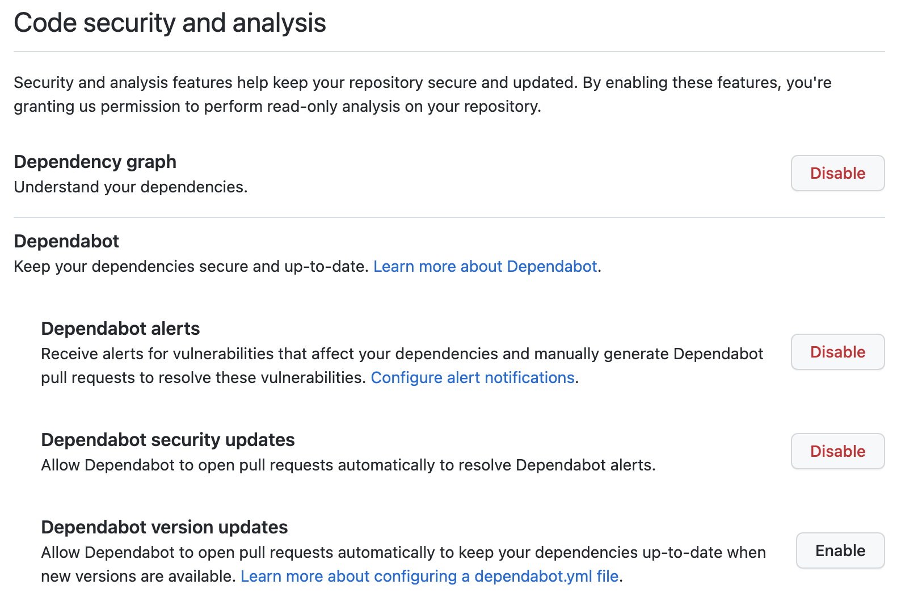
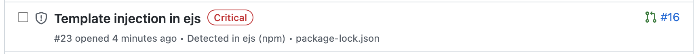
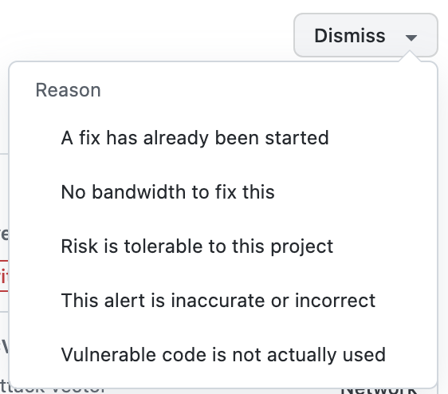

# Exercise 1 - Turn on Dependabot

In this exercise we'll turn on Dependabot and examine the results for our repository.

1. In your repository, navigate to `Settings`, then `Code security and analysis`.
2. Scroll down and enable the `Dependency graph`, `Dependency alerts`, and `Dependabot security updates`.

3. Navigate to the `Security` tab in your repository, then click on `Dependabot alerts` on the left menu.
4. Open `package.json` file in the root directory and update the version for `ejs` to `3.1.1` (shold be line #13). Open `package-lock.json` file in the root repository and update the version for `ejs` to `3.1.1`(should be line #162). Commit to the main branch.
5. Go to Dependabot under Security tab. Dependabot should have detected a vunerable dependency in the project.
6. Find the `Template injection in ejs` issue marked as critical. Note that there's a pull request icon in that row! Click the title of the alert.

5. Examine the details of the alert, then click `Review security update` to be taken to the pull request created by Dependabot.

You'll see that the pull request is just like any other, with details about the fix, links to relevant pages, and even your pull request status checks.

8. After examining the details of the pull request, merge it.
9. Navigate back to the `Dependabot alerts` page on the `Security` tab and you'll see the alert has been closed as fixed.

## Notes:

You don't _have to_ fix an alert raised by dependabot!

If you click on one of the alerts, you'll see a `Dismiss` button on the right that lets you choose a reason for dismissing the alert.

## Extra credit
- Turn on security scanning or code scanning to see what they do!
