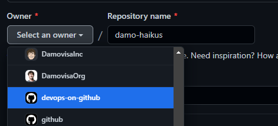

# End to End DevOps with GitHub

Welcome to the **End-to-End DevOps with GitHub** workshop!

This repository is your source for all the workshop materials. You'll find topics in folders and markdown files in each folder with each piece of learning material and exercise.

This repository also has [Discussions](https://github.com/devops-on-github/workshop/discussions) enabled for Q&A and conversation as we go.

# Getting Started:

Let's get started! In this workshop, we will use a template as a baseline.

1. Navigate to this repo and click on `Use this template` as a baseline for your new repository. 

2. Select this workshop Org `devops-on-github` as the owner of your new repository.

3. Choose a name and a description for your new repository that it's easy to remember as your own.
There's no need to include every branch.

4. You're all set, follow the instructions during the workshop.

## Contents

We will start covering the [features and capabilities](https://github.com/features) of the GitHub platform on Day 1. Then we will jump into the automation process with Actions and security posture of your projects in the Cloud with GitHub Advanced security on Day 2.

### Day 1

- [Intro to DevOps](1-Intro-to-DevOps/)
- [Planning and Tracking](2-Planning-and-Tracking/)
  - [Issues](2-Planning-and-Tracking/2.1-GitHub-Issues/)
  - [Discussions](2-Planning-and-Tracking/2.2-Discussions/)
  - [Projects](2-Planning-and-Tracking/2.3-Projects/)
- [The Inner Loop](3-The-Inner-Loop/)
  - [Web Editor](3-The-Inner-Loop/3.1-Web-Editor/)
  - [Codespaces](3-The-Inner-Loop/3.2-Codespaces/)
- Wrap up

### Day 2

- [Automation](4-Automation/)
  - [Actions Basics](4-Automation/4.1-Actions-Basics/)
  - [Actions Advanced](4-Automation/4.2-Actions-Advanced/)
  - [Software Delivery and CI/CD with Actions](4-Automation/4.3-Software-Delivery-CICD/)
  - [Non-CI/CD Automation](4-Automation/4.4-Non-CICD/)
- [GitHub Advanced Security](5-GitHub-Advanced-Security/)
- [Typing it all together](6-End-To-End/)
- Wrap up